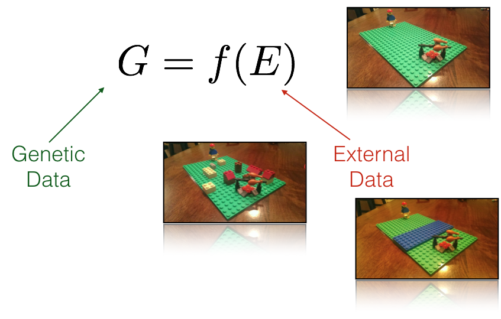

# IBX

The notion of genetic isolation is fundamental to landscape and population genetic studies.
However, its estimation is more complicated than it should be.  This project seeks to provide
an application for the analysis of Isolation by 'whatever'.
